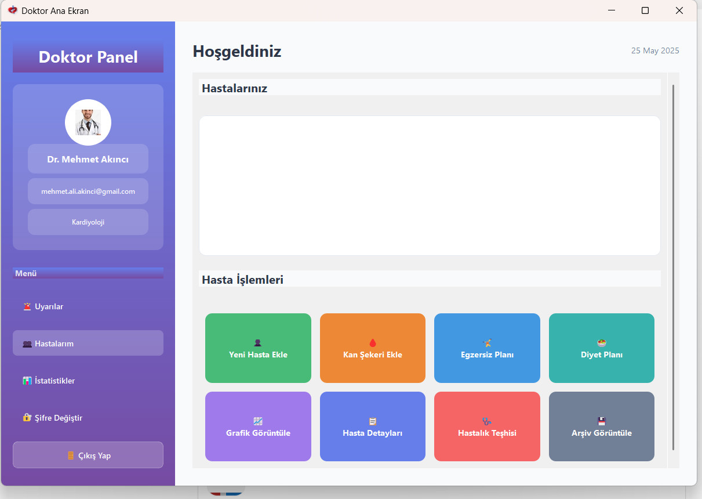
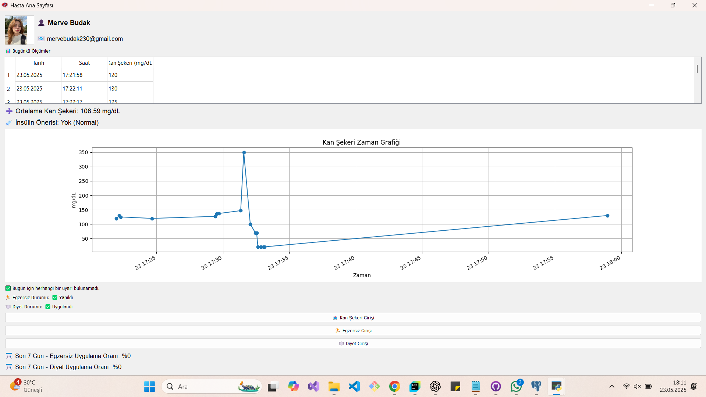
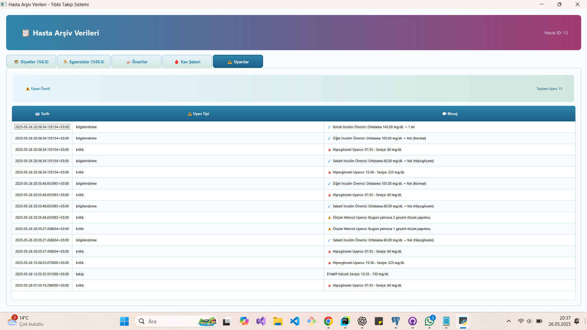
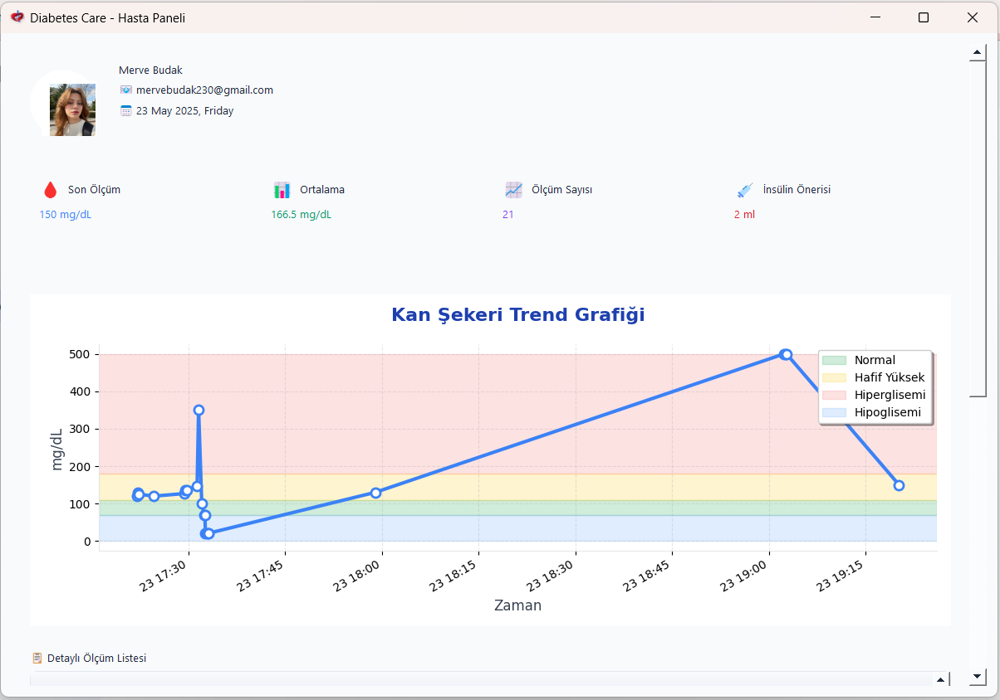

# Diyabet Takip Sistemi

Bu proje, doktorların ve hastaların diyabet yönetimini kolaylaştırmak amacıyla geliştirilmiş, modüler yapıda bir masaüstü uygulamasıdır. İçerisinde kan şekeri takibi, diyet/egzersiz planlaması, uyarı sistemleri ve hastalık teşhis mekanizmaları barındıran kapsamlı bir altyapıya sahiptir.

---

## Proje Hakkında
Diyabet Takip Sistemi, hastaların günlük yaşantılarında rutin kontrollerini yapmalarını sağlarken, doktorların da kendi hastalarını tek bir panelden yönetmesine olanak tanır. Kullanıcı dostu arayüzü sayesinde anlaşılır grafikler ve raporlamalar sunar.

## Temel Özellikler

### Doktor Modülü
- **Hasta Yönetimi:** Sisteme yeni hasta ekleme ve mevcut hastaların arşivlerini detaylı şekilde görüntüleme.
- **Teşhis ve Uyarı Sistemi:** Kritik ve acil durumlar için otomatik uyarı atamaları ve hastalık teşhisi.
- **Diyet ve Egzersiz Planlaması:** Hastanın durumuna özel (Az Şekerli, Şekersiz vb.) diyetler ile Klinik Egzersiz/Bisiklet gibi aktivitelerin planlanması.
- **Grafiksel Takip:** Hastanın kan şekeri dalgalanmalarını saatlik/öğünlük grafiklerle analiz etme.

### Hasta Modülü
- **Veri Girişi:** Düzenli kan şekeri ölçümlerinin ve poliüri, yorgunluk, bulanık görme gibi semptomların sisteme işlenmesi.
- **Öneri Motoru:** Girilen değerlere göre hastayı bilgilendiren özel öneri sistemi.
- **Takip:** Doktor tarafından atanan egzersiz ve diyetlerin durum ("uygulandı/uygulanmadı") takibi.

## Kullanılan Teknolojiler
- **Programlama Dili:** Python 3.x
- **Kullanıcı Arayüzü (GUI):** PyQt5
- **Veritabanı:** PostgreSQL (psycopg2)
- **Veri Görselleştirme:** Matplotlib / PyQtGraph (Grafik modülleri)

## Kurulum ve Çalıştırma

1. Projeyi bilgisayarınıza klonlayın:
   ```bash
   git clone https://github.com/mervebudakk/DiabetesTrackingSystem.git
   cd DiabetesTrackingSystem
   ```
2. Gerekli bağımlılıkları yükleyin:
   ```bash
   pip install PyQt5 psycopg2 matplotlib
   ```
3. Veritabanı kurulumunu yapın:
   - PostgreSQL üzerinde `diabetes_tracking_system` adında bir veritabanı oluşturun.
   - Proje dizinindeki `database.sql` ve `diabetes_schema.sql` dosyalarını içe aktarın (import).
   - `veritabani.py` içindeki şifre/kullanıcı adı bilgilerini kendi PostgreSQL yapılandırmanıza göre güncelleyin.
4. Uygulamayı başlatın:
   ```bash
   python app.py
   ```

## Ekran Görüntüleri

Aşağıda uygulamanın ana modüllerine ait ekran görüntüleri sunulmuştur.

<div align="center">
   &nbsp;
  
</div>
<br>
<div align="center">
   &nbsp;
  
</div>
